#### 混合ガウスモデルとEMアルゴリズム

---

<font size='5'>
今回ははじパタの10章とPRMLの9章を参考に，  
EMアルゴリズムについて発表します．  
<p></p>
本当はトピックモデルについて発表しようと思ったのですが，  
EMアルゴリズムの知識が必要なので今日紹介します．  
<font size='4'>
（※ いずれトピックモデルの紹介もしたいと思っています．）
</font>

</font>

---

#### 目次

- <font size ='5'> $K$-means法 </font>
- <font size='5'> 混合ガウスモデル </font>
- <font size='5'> EMアルゴリズム </font>
- <font size='5'> 計算実験 </font>

---

#### $K$-means法

---

<font size='5'>
まずは$K$-means法を紹介します．  
その理由は$K$-means法のアルゴリズムはクラスターの中心を  
EMアルゴリズムで求めている手法と言えるからです．  
<p></p>
とにかく，EMアルゴリズムをはじめて学習する場合には$K$-means法のアルゴリズムの  
理解が手助けになるので先に紹介しておきます．  
<font size='4'>
（※ 今日の主題はEMアルゴリズムです．)
</font>

</font>

---

<font size='5'>

$D$次元ユークリッド空間上の確率変数$\mathbf{x}$の$N$個の観測点で構成される  
データ集合$\{ \mathbf{x}\_1,\dots,\mathbf{x}\_N \}$が存在する場合を考えます．
<p></p>
$K$-means法では，データ集合を$K$個のクラスタに分割することを目的とします．  
<font size='4'>
(※  とりあえず今回は$K$の値は既知であると仮定します．)
</font>
</font>

---

<font size='5'>

直感的にクラスタとは，その内部のデータ点間の距離が，  
外部のデータとの距離と比べて小さいデータのグループのことです．

<p>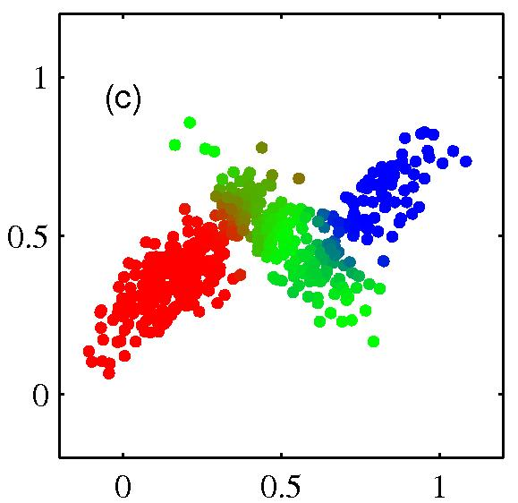</img>  
<font size='4'>
(※  図はサンプルデータに対して混合ガウスモデルを用いてクラスタリングをした結果です．)
</font>
</font>

---

<font size='5'>

これは代表ベクトルと呼ばれる$K$個の$D$次元ベクトル$\mathbf{\mu}\_k \;\; (k=1,\dots,K)$を  
導入することで定式化することができます．($\mathbf{\mu}\_k$は$K$番目のクラスタの代表ベクトルです)

<p></p>

先に言っておくと，$\mathbf{\mu}\_k$は$K$番目のクラスタの中心とみなすことができます．

</font>

---

<font size='5'>

$K$-means法では，ベクトルの集合$\{ \mathbf{\mu}\_k \}$をうまく決定し，  
全データ点をうまく各クラスタに対応させることで，  
各データ点から対応する$\mathbf{\mu}\_k$への二乗平均の総和の最小化を目指します．

</font>

---

<font size='5'>

ここで，データ点のクラスタへの割当を表す記法を定義しておくと便利です．  
データ$\mathbf{x}\_n$がクラスタ$k$に帰属するか否かを表す変数$r\_{nk}$を以下の様に定義します．

\begin{eqnarray}
r\_{nk} = \begin{cases}
        1 & (\mathbf{x}\_nがクラスタkに属する場合) \\\\
        0 & (それ以外の場合)
        \end{cases} 
\end{eqnarray}

---

<font size='5'>
そして，$K$-means法の目的関数$J$を次の様に定義します．

\begin{equation}
J = \sum\_{n=1}^{N} \sum\_{k=1}^{K} r\_{nk} \|\| \mathbf{x}\_n - \mathbf{\mu}\_k \|\|^2
\end{equation}

これは各データ点からそれらが割り当てられたベクトル$\mathbf{\mu}\_k$までの  
二乗和の総和を表しており，歪み尺度と呼ばれることもあります．  

* <font color='firebrick'>$K$-means法の目的は，$J$を最小にする$\{ r\_{nk} \}$と$\{ \mathbf{\mu}\_k \}$を求めることです． </font> *

</font>

---

<font size='5'>

$J$の最小化は$\mathbf{\mu}\_k$を初期化した後に，次の2つのステップを繰り返すことで実現できます． 
<p></p>
<div style="padding: 20px; margin-bottom: 10px; border: 2px solid #333333;">

<table align="center">
<tr><td>
【Eステップ】: $\mathbf{\mu}\_k$を固定しつつ$r\_{nk}$について$J$を最小化する．<br>
【Mステップ】: $r\_{nk}$を固定しつつ$\mathbf{\mu}\_{nk}$について$J$を最小化する．<br>
</td></tr>
</table>
</div>

<font size='4'>
※ $\mathbf{\mu}\_{k}$と$r\_{nk}$を更新する２つのフェーズが，それぞれEMアルゴリズムにおける  
E(expectation)ステップとM(maximization)ステップに対応します．
</font>

</font>

---

<font size='5'>

まず，$r\_{nk}$について$J$を最小化することを考えます．  
$J = \sum\_{n=1}^{N} \sum\_{k=1}^{K} r\_{nk} \|\| \mathbf{x}\_n - \mathbf{\mu}\_k \|\|^2$より，$J$は$r\_{nk}$について線形なので，  
最適化は代数的に解くことが可能です．
<p></p>
異なる$n$を含む項は互いに独立なので，各$n$について別々に，$\|\| \mathbf{x}\_n - \mathbf{\mu}\_k \|\|^2$が  
最小になるような$k$の値に対して$r\_{nk}=1$とすれば良いです．  

<p></p>
つまり，次式のように$r\_{nk}$を決めれば良いです．
\begin{eqnarray}
r\_{nk} = \begin{cases}
        1 & k=\mathrm{arg} \min\_j \|\| \mathbf{x}\_n - \mathbf{\mu}\_j \|\|^2のとき \\\\
        0 & (それ以外の場合)
        \end{cases} 
\end{eqnarray}
</font>

---

<font size='5'>

次に$\mathbf{\mu}\_k$について$J$を最小化することを考えます．  
$J = \sum\_{n=1}^{N} \sum\_{k=1}^{K} r\_{nk} \|\| \mathbf{x}\_n - \mathbf{\mu}\_k \|\|^2$より，$J$は$\mathbf{\mu}\_k$の二次関数なので，  
次のように$\mathbf{\mu}\_k$に関する偏微分を$0$を置くことで最小化できます．
\begin{equation}
2 \sum\_{n=1}^N r\_{nk}(\mathbf{x}\_n - \mathbf{\mu}\_k) = 0
\end{equation}

</font>

---

<font size='5'>

$\mathbf{\mu}\_k$について解くと，次式を得ます．  
\begin{equation}
\mathbf{\mu}\_k = \frac{\sum\_n r\_{nk} \mathbf{x}\_n}{\sum\_n r\_{nk}}
\end{equation}
この式は，$\mathbf{\mu}\_k$を$k$番目のクラスタに割り当てられたすべてのデータ点$\mathbf{x}\_n$の  
平均値とおいていると解釈することができます．(これが$K$-means法の名の由来です)

</font>

---

<font size='5'>

$K$-means法のアルゴリズムをまとめると次のようになります．
<p></p>
<div style="padding: 20px; margin-bottom: 10px; border: 2px solid #333333;">

<table align="center">
<tr><td>
1. $\mathbf{\mu}\_k$の初期値を選ぶ<br>
<p></p>
2.【Eステップ】以下の式で$r\_{nk}$を計算．<br>
\begin{eqnarray}
r\_{nk} = \begin{cases}
        1 & k=\mathrm{arg} \min\_j \|\| \mathbf{x}\_n - \mathbf{\mu}\_j \|\|^2のとき \\\\
        0 & (それ以外の場合)
        \end{cases} 
\end{eqnarray}
<p></p>
3.【Mステップ】求めた$r\_{nk}$で$\mathbf{\mu}\_{nk}$を再計算．<br>
\begin{equation}
\mathbf{\mu}\_k = \frac{\sum\_n r\_{nk} \mathbf{x}\_n}{\sum\_n r\_{nk}}
\end{equation}

4. 収束条件が満たされていなければ，ステップ2に戻る．
</td></tr>
</table>
</div>

<font size='4'>
上記のようにEステップとMステップを収束するまで（もしくはあらかじめ定めた  
最大繰り返し数を超えるまで）繰り返します．
</font>

</font>

---

<font size='5'>
図$(a)$-$(i)$はサンプルデータに$K$-means法を適用した結果です．  
</font>
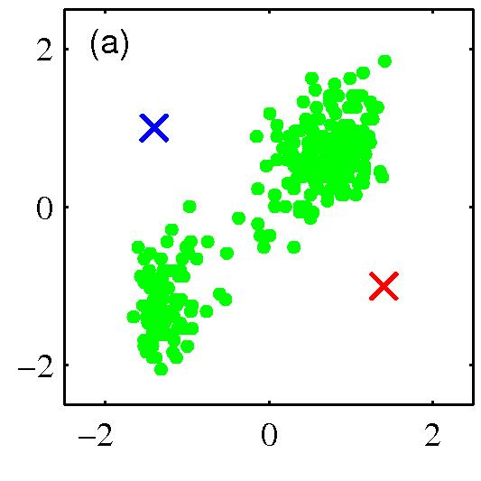</img>
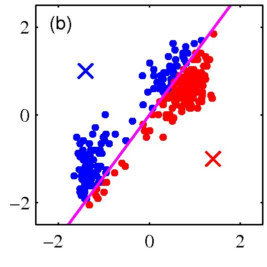</img>
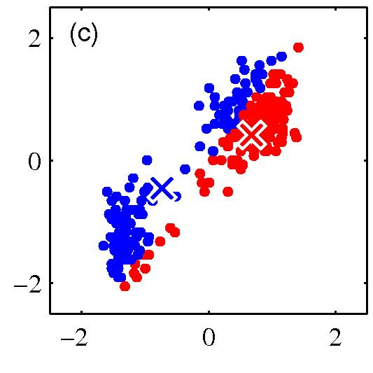</img>  

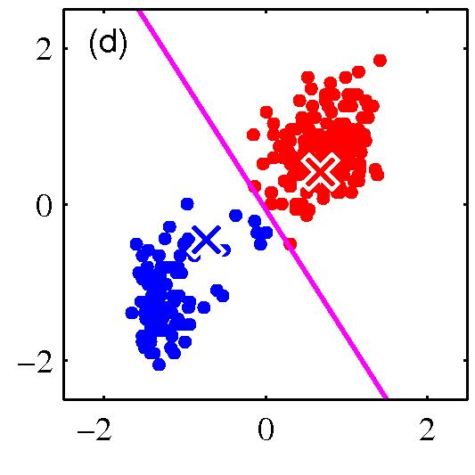</img>
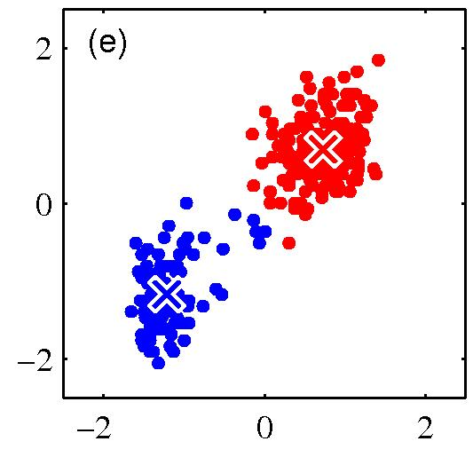</img>
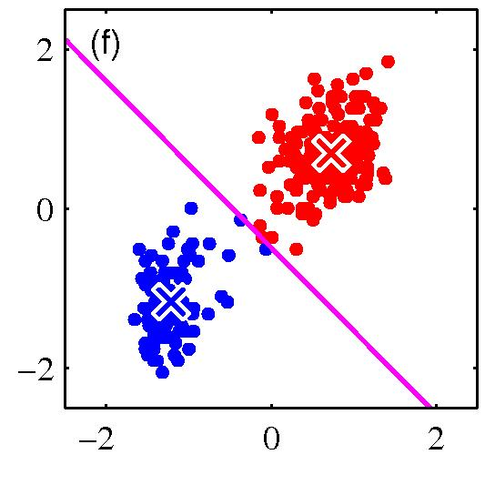</img>  

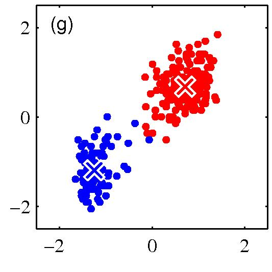</img>
</img>
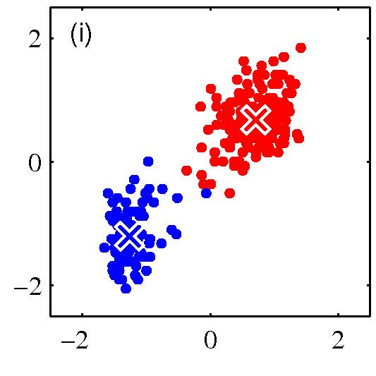</img>  

<font size='4'>
ステップを繰り返すごとにクラスターの割り当てが改善されていることがわかります．
</font>

---

<font size='5'>

ちなみに，$K$-means法の目的関数$J = \sum\_{n=1}^{N} \sum\_{k=1}^{K} r\_{nk} \|\| \mathbf{x}\_n - \mathbf{\mu}\_k \|\|^2$の  
ユークリッド距離の部分をより一般な非類似度$\nu(\mathbf{x}, \mathbf{x}')$に置き換えた目的関数  
\begin{equation}
J = \sum\_{n=1}^{N} \sum\_{k=1}^{K} r\_{nk} \nu(\mathbf{x}, \mathbf{x}') 
\end{equation}
の最小化を考えるアルゴリズムは$K$-medoids法と呼ばれます．

</font>

---

#### 混合ガウスモデル

---

<font size='5'>

$K$-means法を用いたクラスタリングは，一つのデータは一つのクラスタにのみ  
分類されるので，ハードクラスタリングとも呼ばれます．
<p></p>
一方で，データ分布に確率モデルを当てはめて，どのクラスタに属するかは  
確率的は決まるクラスタリングはソフトクラスタリングと呼ばれます．
<p></p>
<font color='firebrick'>
<u>今回は混合ガウスモデルでソフトクラスタリングを行う例を通じて，  
** EMアルゴリズム ** の説明をします．</u>
</font>

</font>

---

<font size='5'>
混合ガウス分布とは，いくつかのガウス分布を線形結合した分布のことです．   
$K$個のガウス分布の線形結合で表すことができる混合ガウス分布は次式で定義できます．
\begin{equation}
p(\mathbf{x}) = \sum\_{k=1}^K \pi\_k \mathcal{N}(\mathbf{x} \| \mathbf{\mu}\_k, \Sigma\_k), \;\; 0 \le \pi\_k \le 1, \;\; \sum\_{k=1}^K \pi\_k = 1
\end{equation}
ここで，$\pi\_k$を混合係数と呼び，混合ガウス分布のパラメータは以下の通りです．
\begin{equation}
\mathbf{\pi} = (\pi\_1, \dots, \pi\_K), \;\; \mathbf{\mu} = (\mathbf{\mu}\_1, \dots, \mathbf{\mu}\_K), \;\; \Sigma = (\Sigma\_1, \dots, \Sigma\_K)
\end{equation}
<p></p>
また，混合ガウス分布を用いたモデルを混合ガウスモデルと呼びます．

</font>

---

<font size='5'>
ガウス分布の線形結合は非常に複雑な密度関数になり得ることがわかります．
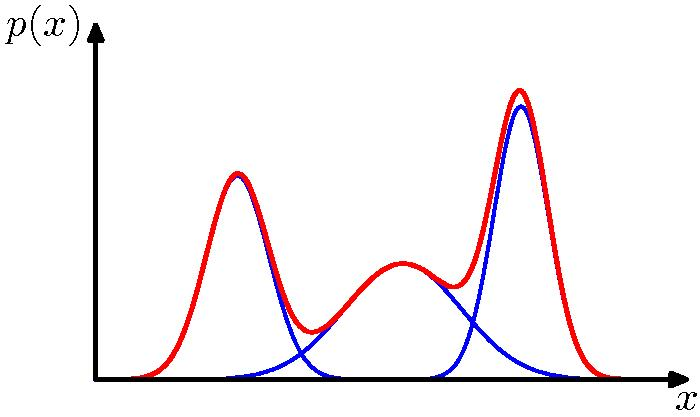</img>  
図は３つのガウス分布（青線，係数に応じた比率で縮小してある）と  
これらの和（赤線）で示した，一次元中での混合ガウス分布の例です．
</font>

---

<font size='5'>
今度は二次元空間中の混合ガウス分布の例です．  
</font>
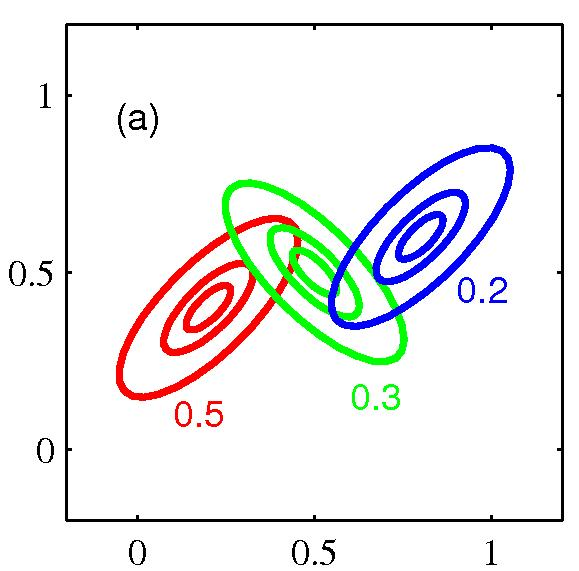</img>
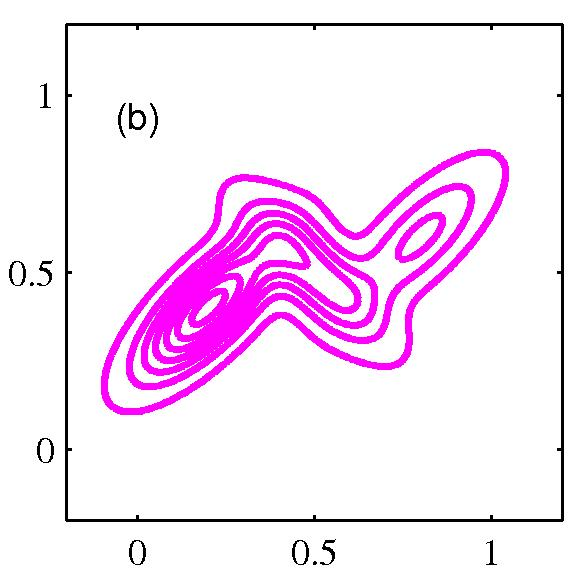</img>
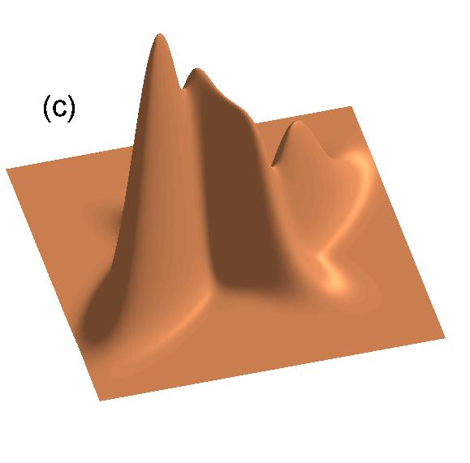</img>  
<font size='4'>
図(a)は赤緑青で３つの混合要素の等高線をそれぞれの混合係数とともに示しています．  
図(b)は混合分布の周辺確率密度$p(\mathbf{x})$の等高線，図(c)は分布$p(\mathbf{x})$の曲線グラフを示しています．
</font>

---

<font size='5'>
十分な数のガウス分布を用いて，うまくパラメータを調節すれば，  
ほぼ任意の連続な密度関数を任意の精度で近似することができます．
<p></p>
ここで，混合ガウスモデルのパラメータをEMアルゴリズムを用いて推定するために，  
<font color='firebrick'> 隠れ変数(hidden variable) </font> と呼ばれる変数を導入します．

</font>

---

<font size='5'>
隠れ変数とは，実際に観測することはできませんが，  
変数間の関係の解釈に影響を与える変数です．
<p></p>
今回は一つのデータが$K$個のクラスタのうちどのクラスタに属しているかを表現する  
$K$次元のベクトル$\mathbf{z}$を隠れ変数として導入します．  

\begin{equation}
\mathbf{z} = (z\_1, \dots, z\_K)^{\mathbf{T}}
\end{equation}

</font>

---

<font size='5'>

$\mathbf{z} = (z\_1, \dots, z\_K)^{\mathrm{T}}$の$z\_k$は，データが$k$番目のクラスタに属していれば1，属していなければ0をとります．一つのデータは一つのクラスタに属するので以下が成り立ちます．

\begin{eqnarray}
\sum\_{k=1}^{K} z\_k = 1, \;\; \mathbf{z} = ( \underbrace{0,\dots,0,1,0,\dots,0}\_{どこか一つだけ1})^{\mathbf{T}}
\end{eqnarray}

<p></p>
$K$-means法では$r\_{nk}$が隠れ変数に対応していました．  
隠れ変数を導入することで，生成モデルについて考えやすくなります．
<p></p>
次で，隠れ変数を用いた混合ガウス分布の定式化を行うことにします．

</font>

---

<font size='5'>

実際に観測される変数$\mathbf{x}$と隠れ変数$\mathbf{z}$の同時分布は，  
ベイズの定理より以下のようにかけます．

\begin{eqnarray}
p(\mathbf{x}, \mathbf{z}) = p(\mathbf{z})p(\mathbf{x} \| \mathbf{z})
\end{eqnarray}

</font>

---

<font size='5'>

ここで，$\mathbf{z}$の周辺分布は以下のように定まるとします．  

\begin{eqnarray}
p(z\_k = 1) = \pi\_k
\end{eqnarray}

ただし，パラメータ$\{ \pi\_k \}$は以下を満たします．  

\begin{eqnarray}
0 \le \pi\_k \le 1, \;\; \sum\_{k=1}^K \pi\_k =1
\end{eqnarray}

<p></p>
この時$\mathbf{z}$の分布は以下のようにかけます．

\begin{eqnarray}
p(\mathbf{z}) = \prod\_{k=1}^K \pi\_k^{z\_k}
\end{eqnarray}

</font>

---

<font size='5'>

また，$\mathbf{z}$が与えられた元での$\mathbf{x}$条件付き分布は以下のようになります．

\begin{eqnarray}
p(\mathbf{x} \| z\_k = 1) = \mathcal{N}( \mathbf{x}\| \mathbf{\mu}\_k, \Sigma\_k)
\end{eqnarray}

<p></p>
これも，先ほどと同様に$\mathbf{z}$を用いることで以下のようにかけます．
\begin{eqnarray}
p(\mathbf{x} \| \mathbf{z}) = \prod\_{k=1}^{K} \mathcal{N}(\mathbf{x} \| \mathbf{\mu}\_k, \Sigma\_k)^{z\_k}
\end{eqnarray}

</font>

---

<font size='5'>

したがって，以下の式変形が成り立ちます．
\begin{eqnarray}
p(\mathbf{x}) = \sum\_{\mathbf{z}} p(\mathbf{x}, \mathbf{z}) =  \sum\_{\mathbf{z}} p(\mathbf{z})p(\mathbf{x} \| \mathbf{z}) = \sum\_{k=1}^K \pi\_k \mathbf{N}(\mathbf{x} \| \mathbf{\mu}\_k, \Sigma\_k)
\end{eqnarray}

以上より，混合ガウスモデルを隠れ変数を含む別の表現で定式化することができました．
<p></p>
「なにがうれしいの？」と思うかもしれませんが，これで$p(\mathbf{x})$ではなく$p(\mathbf{x},\mathbf{z})$を使った  
計算が可能になるため有効です．（EMアルゴリズムも適用できます．）

</font>

---

<font size='5'>

$p(\mathbf{x})$ではなく$p(\mathbf{x},\mathbf{z})$を考えるとはどういうことなのか少しだけ考えてみましょう．  
<p></p>
データ集合$\mathbf{x}$を不完全データ集合，データ集合$\\{ \mathbf{x, \mathbf{z}}\\}$を完全データ集合と呼びます．  
完全データ集合では隠れ変数$\mathbf{z}$ごとに場合を分けて考えることで，  
全体をシンプルな部分構造の集まりと捉えることができます．（次のスライド）


</font>


</font>

---

<font size='4'>

図は３つのガウス分布の混合から生成した500点の例です．  
左図は$p(\mathbf{z})p(\mathbf{x}\|\mathbf{z})$からのサンプルで，$\mathbf{z}$の状態ごとに赤，緑，青に色分けされています（完全データ）．  
右図は同じサンプルを周辺分布$p(\mathbf{x})$から生成されたものとしています．$\mathbf{z}$に関する情報はありません．（不完全データ）  

</img>
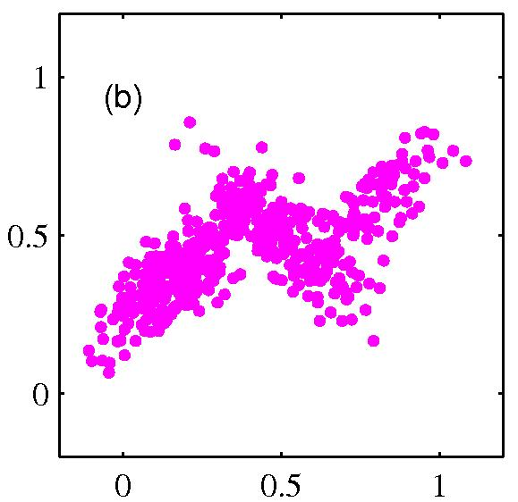</img>  
完全データの場合は$\mathbf{z}$の状態ごとに考えれば単なるガウス分布を考えればよく，問題を考えやすくなります．  
ただし，隠れ変数は観測することができないため，工夫をする必要があります．

</font>

---

#### EMアルゴリズム

---

<font size='5'>
<font color='firebrick'>EM(expectation-maximization)アルゴリズム</font>は隠れ変数モデルにおける  
パラメータの最尤推定値$p(\mathbf{X} \| \theta)$を求めるための手法です．
<p></p>
したがって，隠れ変数$\mathbf{z}$をもつ混合ガウスモデルにも適用することができます．  
<font size='4'>
(※  勿論EMアルゴリズムは他の様々な隠れ変数モデルにも適用できます．)
</font>

</font>

---

<font size='5'>

EMアルゴリズムはパラメータの最尤推定値を求める為に，  
二つのステップを収束条件を満たすまで繰り返します．
<p></p>
<div style="padding: 20px; margin-bottom: 10px; border: 2px solid #333333;">

<table align="center">
<tr><td>
【Expectation step】<br>
確率モデルのパラメータを固定して，隠れ変数の事後確率を求めます．(期待値を求める)<br>
<p></p>
【Maximization step】<br>
隠れ変数の事後確率を$Q$関数に代入して，$Q$関数を最大にするパラメータを求めます．<br>

</td></tr>
</table>
</div>

</font>


---

#### 一般化したEMアルゴリズム

<font size='4'>

観測変数$\mathbf{X}$と潜在変数$\mathbf{Z}$の同時分布$p(\mathbf{X},\mathbf{Z} \| \mathbf{\theta})$が与えられていて，パラメータ$\mathbf{\theta}$で支配されているとします．  
EMアルゴリズムでは尤度関数$p(\mathbf{X}\| \mathbf{\theta})$を$\mathbf{\theta}$について最大化するために以下のようにします．
<p></p>

<div style="padding: 20px; margin-bottom: 10px; border: 2px solid #333333;">

<table align="center">
<tr><td>
1. パラメータの初期値$\mathbf{\theta}^{old}$を選ぶ．<br>
2.【Eステップ】$p(\mathbf{Z} \| \mathbf{X}, \mathbf{\theta}^{old})$を計算する．<br>
3.【Mステップ】次式で与えられる$\mathbf{\theta}^{new}$を計算する．<br>

\begin{eqnarray}
\mathbf{\theta}^{new} = \mathrm{arg} \max\_{\mathbf{\theta}} Q(\mathbf{\theta}, \mathbf{\theta}^{old})
\end{eqnarray}

ただし，

\begin{eqnarray}
Q(\mathbf{\theta},\mathbf{\theta}^{old}) = \sum\_{\mathbf{Z}} p(\mathbf{Z} \| \mathbf{X},\mathbf{\theta}^{old}) \mathrm{ln}p(\mathbf{X},\mathbf{Z} \| \mathbf{\theta}) 
\end{eqnarray}

4.収束条件が満たされていなければ，ステップ2に戻る．

</td></tr>
</table>
</div>

</font>

---

<font size='5'>
はじめに紹介した$K$-means法のアルゴリズムと見比べると，  
EMアルゴリズムの大まかな流れがつかみやすいです．

<font size='4'>
<p></p>
<div style="padding: 20px; margin-bottom: 10px; border: 2px solid #333333;">

<table align="center">
<tr><td>
1. $\mathbf{\mu}\_k$の初期値を選ぶ<br>
<p></p>
2.【Eステップ】以下の式で$r\_{nk}$を計算．<br>
\begin{eqnarray}
r\_{nk} = \begin{cases}
        1 & k=\mathrm{arg} \min\_j \|\| \mathbf{x}\_n - \mathbf{\mu}\_j \|\|^2のとき \\\\
        0 & (それ以外の場合)
        \end{cases} 
\end{eqnarray}
<p></p>
3.【Mステップ】求めた$r\_{nk}$で$\mathbf{\mu}\_{nk}$を再計算．<br>
\begin{equation}
\mathbf{\mu}\_k = \frac{\sum\_n r\_{nk} \mathbf{x}\_n}{\sum\_n r\_{nk}}
\end{equation}

4. 収束条件が満たされていなければ，ステップ2に戻る．
</td></tr>
</table>
</div>
</font>

</font>

---

<font size='5'>

それではいよいよ，混合ガウスモデルにEMアルゴリズムを適用して，  
EMアルゴリズムの流れをつかみしょう．
<p></p>
ただし，途中で何を計算しているのかわからなくなると困るので，  
結果だけ先に紹介します．(ここだけ知っておけば実装はできます．)

</font>

---

<font size='5'>
以下が混合ガウスモデルにおけるEMアルゴリズムです．

<font size='4'>
<p></p>
<div style="padding: 20px; margin-bottom: 10px; border: 2px solid #333333;">

<table align="center">
<tr><td>
1. $\pi\_k, \mathbf{\mu}\_k, \mathbf{\Sigma}\_k$の初期値を選ぶ<br>
<p></p>
2.【Eステップ】現在のパラメータを用いて$\gamma(z\_{nk})$を計算．<br>
\begin{eqnarray}
\gamma(z\_{nk}) = \frac{\pi\_k \mathbf{N}(\mathbf{x}\_n \| \mathbf{\mu}\_k, \mathbf{\Sigma\_k})}{\sum\_{j=1}^K \pi\_j \mathbf{N}(\mathbf{x}\_n \|\mathbf{\mu}\_j, \mathbf{\Sigma}\_j)}
\end{eqnarray}
<p></p>
3.【Mステップ】計算した$\gamma(z\_{nk})$を用いてパラメータを再計算<br>
\begin{eqnarray}
N\_k &=& \sum\_{i=1}^N \gamma(z\_{nk}) \\\\
\mathbf{\mu}\_k^{new} &=& \frac{1}{N\_k} \sum\_{n=1}^N \gamma(z\_{nk}) \mathbf{x}\_n \\\\
\mathbf{\Sigma}\_k^{new} &=& \frac{1}{N\_k} \sum\_{n=1}^N \gamma(z\_{nk})(\mathbf{x}\_n - \mathbf{\mu}\_k^{new})(\mathbf{x}\_n - \mathbf{\mu}\_k^{new})^{\mathbf{T}}  \\\\
\mathbf{\pi\_k}^{new} &=& \frac{N\_k}{N}
\end{eqnarray}

4. 収束条件が満たされていなければ，ステップ2に戻る．
</td></tr>
</table>
</div>
</font>

以降のスライドでそれぞれの式の導出を確認します．

</font>

---


<font size='5'>

まず，$\mathbf{\pi}, \mathbf{\mu}, \mathbf{\Sigma}$が与えられている時の$\gamma(z\_{nk})$の導出を考えます．  
ここで$\gamma(z\_{nk})$はデータ$\mathbf{x\_n}$がクラス$k$に所属する確率であるとします．  
すなわち，$\mathbf{\pi},\mathbf{\mu}, \mathbf{\Sigma},\mathbf{x}\_n$が与えられた場合の$z\_{nk}$の事後確率であるとします．
<p></p>
この値はベイズの定理より以下のように求めることができます．  

\begin{eqnarray}
\gamma(z\_{nk}) \equiv p(z\_{nk} = 1 \| \mathbf{x}\_n) &=& \frac{p(z\_{nk}=1) p(\mathbf{x}\_n \| z\_{nk}=1)}{p(\mathbf{x}\_n)} \\\\
&=& \frac{p(z\_{nk}=1) p(\mathbf{x}\_n \| z\_{nk}=1)}{\sum\_{j=1}^{K} p(z\_{nj}=1) p(\mathbf{x}\_n \| z\_{nj} = 1)} \\\\
&=& \frac{\pi\_k \mathcal{N}(\mathbf{x}\_n \| \mathrm{\mu}\_k, \mathbf{\Sigma}\_k)}{\sum\_{j=1}^{K} \pi\_j \mathcal{N}(\mathbf{x}\_n \| \mathbf{\mu}\_j, \mathbf{\Sigma}\_j)}
\end{eqnarray}

これでEステップに用いられる式の導出は終了です．


</font>

---

<font size='5'>
次に，Mステップに用いられる式を導出します．  
$\gamma(z\_{nk})$が与えられているという条件の元で各パラメータを推定します．  
<p></p>
そこで不完全データ$\mathbf{X}$ではなく，完全データ$\\{\mathbf{X},\mathbf{Z} \\}$に対する尤度の最大化を目指します．  
<font size='4'>
(※ 尤度の最大化を行うためM(Maximization)ステップと呼ばれます．）
</font>

</font>

---

<font size='5'>

今，データ集合$\\{\mathbf{X}, \mathbf{Z}\\}$に関する尤度関数は以下のように書けます．  

\begin{eqnarray}
p(\mathbf{X}, \mathbf{Z} \| \mathbf{\mu}, \mathbf{\Sigma}, \mathbf{\pi}) = \prod\_{n=1}^{N} \prod\_{k=1}^{K} \pi\_k^{z\_nk} \mathcal{N}(\mathbf{x}\_n \| \mathbf{\mu}\_k, \mathbf{\Sigma}\_k)^{z\_{nk}}
\end{eqnarray}

さらに，対数を取れば以下のように変形できます．  

\begin{eqnarray}
\mathrm{ln}p(\mathbf{X}, \mathbf{Z} \| \mathbf{\mu}, \mathbf{\Sigma}, \mathbf{\pi}) = \sum\_{n=1}^{N} \sum\_{k=1}^{K} z\_{nk}\\{ \mathrm{ln} \pi\_k  + \mathrm{ln} \mathcal{N}(\mathbf{x}\_n \| \mathbf{\mu}\_k, \mathbf{\Sigma}\_k)\\}

\end{eqnarray}

</font>

---

<font size='5'>
ここで$\mathrm{ln}p(\mathbf{X}, \mathbf{Z} \| \mathbf{\mu}, \mathbf{\Sigma}, \mathbf{\pi}) = \sum\_{n=1}^{N} \sum\_{k=1}^{K} z\_{nk}\\{ \mathrm{ln} \pi\_k  + \mathrm{ln} \mathcal{N}(\mathbf{x}\_n \| \mathbf{\mu}\_k, \mathbf{\Sigma}\_k)\\}$
の最大化を考えます．
<p></p>
ただし，隠れ変数$z\_{nk}$は実際にはわからないので，  
最尤推定値を直接求めることはできません．  
$z\_{nk}$についてわかることは$z\_{nk}$の事後分布$\gamma(z\_{nk})$だけです．

</font>

---

<font size='5'>

したがって，EMアルゴリズムでは完全データの対数尤度の，  
<font color='firebrick'>**隠れ変数に関する期待値の最大化**</font>を考えます．  
<font size='4'>
(※  これが Expectation Maximization Algorithm の名前の由来です)  
</font>
すると最大化する関数は以下の関数になります．  

\begin{eqnarray}
\mathbb{E}\_{\mathbf{Z}}[\mathrm{ln}p(\mathbf{X}, \mathbf{Z} \| \mathbf{\mu}, \mathbf{\Sigma}, \mathbf{\pi})] = \sum\_{n=1}^{N} \sum\_{k=1}^{K} \mathbb{E}\_{z\_{nk}}[z\_{nk}]\\{ \mathrm{ln} \pi\_k  + \mathrm{ln} \mathcal{N}(\mathbf{x}\_n \| \mathbf{\mu}\_k, \mathbf{\Sigma}\_k)\\}

\end{eqnarray}

<font size='4'>
($\mathbb{E}\_{x}[\cdot]$は$x$に関する$\cdot$の期待値の期待値を表すとします．)
</font>

</font>

---

<font size='5'>
ところで，隠れ変数に関する期待値$\mathbb{E}\_{z\_{nk}}[z\_{nk}]$は以下のように変形できます．

\begin{eqnarray}
\mathbb{E}\_{z\_{nk}}[z\_{nk}] &=& \sum\_{z\_{nk}=\\{0,1\\}} z\_{nk}p(z\_{nk} \| \mathbf{x}\_n, \pi\_k, \mathbf{\mu}\_k, \mathbf{\Sigma}\_k\) \\\\
&=& 1\times p(z\_{ik}=1 \| \mathbf{x}\_n) \\\\
&=& \frac{p(z\_{nk}=1) p(\mathbf{x}\_n \| z\_{nk}=1)}{\sum\_{j=1}^{K} p(z\_{nj}=1) p(\mathbf{x}\_n \| z\_{nj} = 1)} \\\\
&=& \frac{\pi\_k \mathcal{N}(\mathbf{x}\_n \| \mathrm{\mu}\_k, \mathbf{\Sigma}\_k)}{\sum\_{j=1}^{K} \pi\_j \mathcal{N}(\mathbf{x}\_n \| \mathbf{\mu}\_j, \mathbf{\Sigma}\_j)} \\\\
&=& \gamma(z\_{nk})
\end{eqnarray}
つまり先ほど導出した$z\_{nk}$の事後分布$\gamma(z\_{nk})$は，$z\_{nk}$の期待値と一致することがわかります．  

</font>

---

<font size='5'>
したがって，Mステップでは以下の$Q$関数を最大にするパラメータを求めれば良いです．  
<font size='4'>
（※  隠れ変数の期待値を事後確率で置き換えた関数を$Q$関数と呼びます．）
</font>
\begin{eqnarray}
Q = \mathbb{E}\_{\mathbf{Z}}[\mathrm{ln}p(\mathbf{X}, \mathbf{Z} \| \mathbf{\mu}, \mathbf{\Sigma}, \mathbf{\pi})] = \sum\_{n=1}^{N} \sum\_{k=1}^{K} \gamma(z\_{nk})\\{ \mathrm{ln} \pi\_k  + \mathrm{ln} \mathcal{N}(\mathbf{x}\_n \| \mathbf{\mu}\_k, \mathbf{\Sigma}\_k)\\}
\end{eqnarray}
<p></p>
ここで，$\mathcal{N}(\mathbf{x} \| \mathbf{\mu}, \mathbf{\Sigma}) = \frac{1}{(2\pi)^{\frac{d}{2}} \| \Sigma \|^{\frac{1}{2}}} \exp(- \frac{1}{2}(\mathbf{x} - \mathbf{\mu})^{\mathrm{T}} \Sigma^{-1} (\mathbf{x} - \mathbf{\mu}))$より，

\begin{eqnarray}
\mathrm{ln} \mathcal{N}(\mathbf{x}\_n \| \mathbf{\mu}\_k, \mathbf{\Sigma}\_k) = -\frac{1}{2}\mathrm{ln}(2\pi) + \frac{1}{2}\| \Sigma\_k \|^{-1} -\frac{1}{2}(\mathbf{x}\_n - \mathbf{\mu}\_k)^{\mathrm{T}} \mathbf{\Sigma}\_k^{-1} (\mathbf{x}\_n - \mathbf{\mu}\_k)
\end{eqnarray}
となります．

</font>

---

<font size='5'>

まずは$\mathbf{\mu}\_k$を推定します．$Q$関数を微分して$0$とおけば以下のようになります． 

\begin{eqnarray}
\frac{\partial Q}{\partial \mathbf{\mu}\_k} = \sum\_{n=1}^N \gamma(z\_{nk})\Sigma\_k^{-1}(\mathbf{x}\_n - \mathbf{\mu}\_k) = 0
\end{eqnarray}
ここで，$k$番目のクラスタに属するデータ数の推定値は$N\_k = \sum\_{n=1}^{N} \gamma(z\_{nk})$により  
得られるため，$\mathbf{\mu}\_k$の推定値は以下のようになります．
\begin{eqnarray}
\mathbf{\mu}\_k = \frac{1}{N\_k} \sum\_{n=1}^{N} \gamma(z\_{nk})\mathbf{x}\_n
\end{eqnarray}

</font>

---

<font size='5'>

同様の計算(微分して$0$とおく)を$\Sigma\_k$と$\pi\_k$にも行うことで，  
$\mathbf{\Sigma}\_k$と$\pi\_k$の推定値を得ることができます．  
<font size='4'>
(※ 数式の入力に疲れたので省略します...．詳しい式変形ははじパタなどを参照してください．)
</font>
<p></p>
ただし，$\pi\_k$については$\sum\_{k=1}^K \pi\_k = 1$という制約があるので，  
ラグランジュ乗数を導入してラグランジュ関数を微分することに注意してください．
</font>

---

<font size='5'>


<font size='5'>
きちんと計算すれば，既に紹介した混合ガウスモデルにおける  
EMアルゴリズムを導出できるはずです．

<font size='4'>
<p></p>
<div style="padding: 20px; margin-bottom: 10px; border: 2px solid #333333;">

<table align="center">
<tr><td>
1. $\pi\_k, \mathbf{\mu}\_k, \mathbf{\Sigma}\_k$の初期値を選ぶ<br>
<p></p>
2.【Eステップ】現在のパラメータを用いて$\gamma(z\_{nk})$を計算．<br>
\begin{eqnarray}
\gamma(z\_{nk}) = \frac{\pi\_k \mathbf{N}(\mathbf{x}\_n \| \mathbf{\mu}\_k, \mathbf{\Sigma\_k})}{\sum\_{j=1}^K \pi\_j \mathbf{N}(\mathbf{x}\_n \|\mathbf{\mu}\_j, \mathbf{\Sigma}\_j)}
\end{eqnarray}
<p></p>
3.【Mステップ】計算した$\gamma(z\_{nk})$を用いてパラメータを再計算<br>
\begin{eqnarray}
N\_k &=& \sum\_{i=1}^N \gamma(z\_{nk}) \\\\
\mathbf{\mu}\_k^{new} &=& \frac{1}{N\_k} \sum\_{n=1}^N \gamma(z\_{nk}) \mathbf{x}\_n \\\\
\mathbf{\Sigma}\_k^{new} &=& \frac{1}{N\_k} \sum\_{n=1}^N \gamma(z\_{nk})(\mathbf{x}\_n - \mathbf{\mu}\_k^{new})(\mathbf{x}\_n - \mathbf{\mu}\_k^{new})^{\mathbf{T}}  \\\\
\mathbf{\pi\_k}^{new} &=& \frac{N\_k}{N}
\end{eqnarray}

4. 収束条件が満たされていなければ，ステップ2に戻る．
</td></tr>
</table>
</div>
</font>

</font>
</font>

---


<font size='5'>
ここでもう一度一般化したEMアルゴリズムを紹介します．  
少しでもイメージを掴んでいただければ幸いです．  
</font>

<font size='4'>

観測変数$\mathbf{X}$と潜在変数$\mathbf{Z}$の同時分布$p(\mathbf{x},\mathbf{Z} \| \mathbf{\theta})$が与えられていて，パラメータ$\mathbf{\theta}$で支配されているとします．  
EMアルゴリズムでは尤度関数$p(\mathbf{X}\| \mathbf{\theta})$を$\mathbf{\theta}$について最大化するために以下のようにします．
<p></p>

<div style="padding: 20px; margin-bottom: 10px; border: 2px solid #333333;">

<table align="center">
<tr><td>
1. パラメータの初期値$\mathbf{\theta}^{old}$を選ぶ．<br>
2.【Eステップ】$p(\mathbf{Z} \| \mathbf{X}, \mathbf{\theta}^{old})$を計算する．<br>
3.【Mステップ】次式で与えられる$\mathbf{\theta}^{new}$を計算する．<br>

\begin{eqnarray}
\mathbf{\theta}^{new} = \mathrm{arg} \max\_{\mathbf{\theta}} Q(\mathbf{\theta}, \mathbf{\theta}^{old})
\end{eqnarray}

ただし，

\begin{eqnarray}
Q(\mathbf{\theta},\mathbf{\theta}^{old}) = \sum\_{\mathbf{Z}} p(\mathbf{Z} \| \mathbf{X},\mathbf{\theta}^{old}) \mathrm{ln}p(\mathbf{X},\mathbf{Z} \| \mathbf{\theta}) 
\end{eqnarray}

4.収束条件が満たされていなければ，ステップ2に戻る．

</td></tr>
</table>
</div>

</font>


---

<font size='5'>

ところでなぜ尤度関数$p(\mathbf{X} \| \theta)$を直接最大化する代わりに，  
$Q$関数の最大化を考えることができるのでしょうか．
<p></p>
今回は時間の都合上，結果を食いつまむ形で説明します．  
<font size='4'>
(※ 詳細はPRMLに載っているので知りたい方はそちらを参照してください．)
</font>

</font>

---

<font size='5'>
改めて，次式で与えられる尤度関数の最大化を考えます．  
\begin{eqnarray}
p(\mathbf{X} \| \mathbf{\theta}) = \sum\_{\mathbf{Z}}p(\mathbf{X},\mathbf{Z} \| \mathbf{\theta})
\end{eqnarray}
ここで，隠れ変数について分布$q(\mathbf{Z})$を導入すると，$q(\mathbf{Z})$の設定の仕方に関わらず  
次の分解が成り立ちます
<div style="padding: 20px; margin-bottom: 10px; border: 2px solid #333333;">
<font color='firebrick'>
\begin{eqnarray}
\mathrm{ln} p(\mathbf{X} \| \mathbf{\theta}) = \mathcal{L}(q,\mathbf{\theta}) + \mathrm{KL}(q\|\|p)
\end{eqnarray}
</font>
ただし，次の定義をしています．
\begin{eqnarray}
\mathcal{L}(q, \theta) &=& \sum\_{\mathbf{Z}}q(\mathbf{Z}) \mathrm{ln} \Bigl\\{ \frac{p(\mathbf{X},\mathbf{Z}\| \theta)}{q(\mathbf{Z})} \Bigr\\}  \\\\
\mathrm{KL}(q\|\|p) &=& - \sum\_{\mathbf{Z}} q(\mathbf{Z}) \mathrm{ln} \Bigl\\{ \frac{p(\mathbf{Z} \| \mathbf{X}, \theta)}{q(\mathbf{Z})} \Bigr\\}
\end{eqnarray}
</div>

</font>

---

<font size='5'>
ここで，$\mathrm{KL}(q\|\|p) \geq 0$(等号は$q(\mathbf{Z}) = p(\mathbf{Z}\|\mathbf{X},\mathbf{\theta})$の時のみ成立)なので，  
$\mathrm{ln}p(\mathbf{X} \| \theta) \geq \mathcal{L}(q, \theta)$であることがわかります．
<p></p>
つまり，$\mathcal{L}(q,\theta)$は$\mathrm{ln}p(\mathbf{X}\|\theta)$の下界を与えていることがわかります．
さらに，
$\mathcal{L}(q, \theta) = \sum\_{\mathbf{Z}}q(\mathbf{Z}) \mathrm{ln} \Bigl\\{ \frac{p(\mathbf{X},\mathbf{Z}\| \theta)}{q(\mathbf{Z})} \Bigr\\}$は$\theta$の関数であり$q(\mathbf{Z})$は定数になることに注意すると，  
$\mathcal{L}(q,\theta)$の最大化と$\sum\_{\mathbf{Z}}q(\mathbf{Z})\mathrm{ln}p(\mathbf{X},\mathbf{Z} \| \theta)$の最大化が等価になることがわかります． 
<p></p>
つまり$Q$関数を最大化することは$\mathrm{ln}p(\mathbf{X} \| \theta)$の下限を最大化していることと等しいです．  
</font>
<font size='4'>
(※ PRMLにはこの辺りの議論がさらに詳細に記されています．)
</font>

---

<font size='5'>
ちなみに，はじめに紹介した$K$-means法は混合ガウス分布に関するEMアルゴリズムの  
ある極限として導くこともできます．
<p></p>
ざっくりと説明すると，混合ガウスモデルにおいて分散0のガウス分布のみを考えると，$K$-means法と同様のハードな割り当てが可能です．
<font size='4'>
（詳細はPRMLを...)
</font>
<p></p>
ちなみに，$K$-means法はクラスタの平均のみ推定しますが，  
混合ガウスモデルはクラスタの分散も推定するところが大きく異なります．
<p></p>
さらにちなみに，ハード割り当て版の混合ガウスモデルに関するEMアルゴリズムは  
楕円$K$-meansアルゴリズムと呼ばれています．
</font>

---

#### 計算実験

---

<font size='5'>

最後にサンプルデータと使った簡単な計算実験の結果を紹介します．  
pythonのscikit-learnというライブラリを使えばほぼ一行で実装できます．  
<font size='4'>
（※ もちろんデータの準備やプロットの部分は覗いてモデルの実装部分だけ見た場合です．）
</font>
</font>

---

<font size='5'>
今回は$K$-means法と混合ガウスモデルを用いたクラスタリングをしてみました．  
それぞれコードの主要な部分はこんな感じです．
</font>

```.py
# K-means法
from sklearn.cluster import KMeans
y_pred = KMeans(n_clusters=2).fit_predict(X)

#混合ガウスモデル
from sklearn.mixture import GMM
y_pred = GMM(n_components=2).fit_predict(X)

```

<font size='4'>
（※ 詳細はsciket-learnの公式サイトを参照してください．）
</font>

---

<font size='5'> 
まずは$K$-means法を適用した場合の例です．

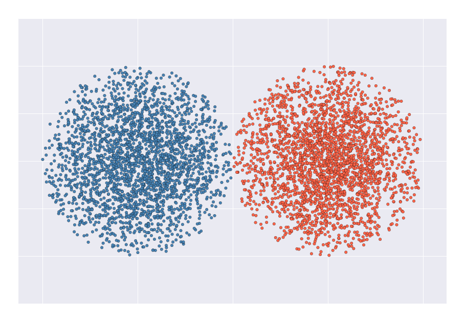</img>  

非常に単純なサンプルですが，うまくクラスタリングできています．

</font>

---

<font size='5'>
ところが$K$-means法は集団の分散に偏りがあったり，  
集団のサイズが異なる場合にうまくいきません．  

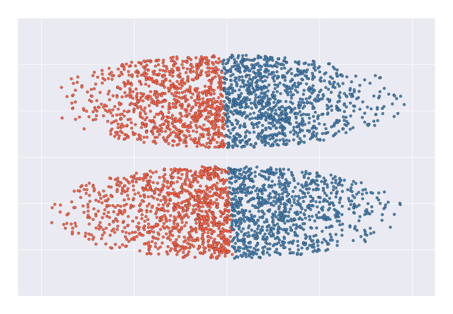</img>
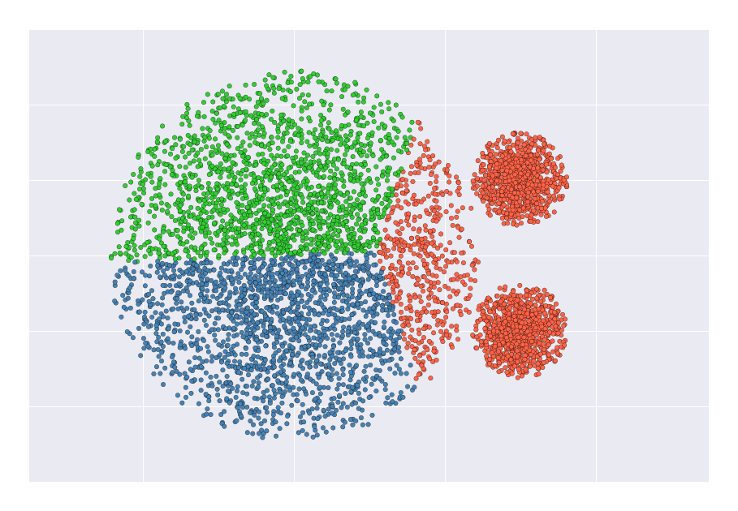</img>  

これは$K$-means法が暗黙のうちに，各クラスタは同じ大きさで  
共分散が単位行列であると仮定しているためです．  
<font size='4'>
(※ $K$-means法を使うときは注意しましょう．)
</font>

</font>

---

<font size='5'>
混合ガウスモデルでも同様の計算実験を行いました．
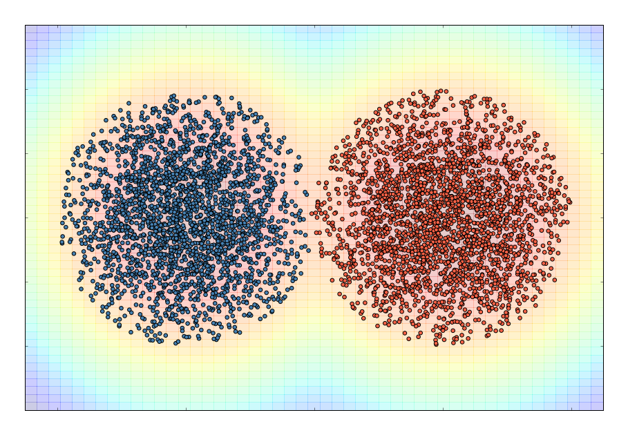</img>  
背景は赤に近いほど密度が高く，青ければ密度が低いことを表しています．  
こちらもこの例ではうまくいっています．
</font>

---

<font size='4'>
$K$-means法の時と同じサンプルを混合ガウスモデルでも試して見ました．  
左の例ではうまくいきましたが，右の例ではうまくいきませんでした．  

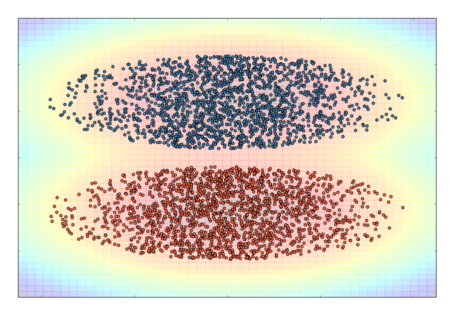</img>
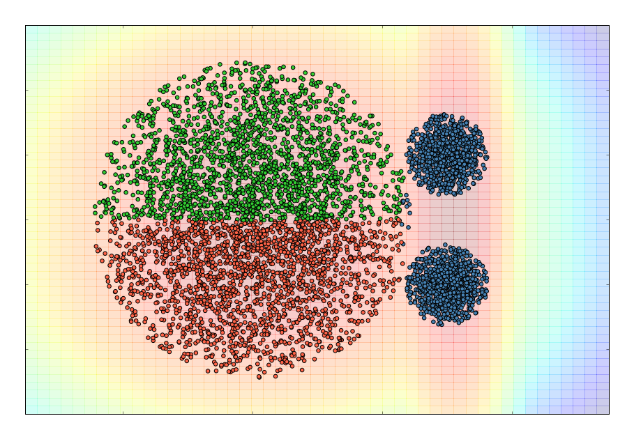</img>  
ただし，注目してもらいたいことは混合ガウスモデルの場合はしっかりと  
集団の分散まで推定しようとしているところです．($K$-means法との大きな違いです．)

</font>

---

<font size='5'>
例で見たとおり，$K$-means法や混合ガウスモデルが有効な場合と  
そうでない場合があるため，その都度考える必要があります．
<p></p>
特にどちらのアルゴリズムも初期値や反復回数によって  
求まる値が毎回変化するため注意が必要です．
<p></p>
加えて，$K$の値は慎重に決定する必要があり，$K$の値が的外れだと  
当然ながら結果も的外れなものになるため注意しましょう．

</font>

---

<font size='5'>
今回は以下のことを紹介しました．  
</font>

- <font size='5'>$K$-means法とはどんなものか  </font>
- <font size='5'>混合ガウスモデルとはどんなものか  </font>
- <font size='5'>EMアルゴリズムとはどんなものか  </font>  
- <font size='5'>簡単な計算実験の結果紹介 </font>
<p></p>
<font size='5'>
次回はデータ解析コンペティションの進捗報告か，  
トピックモデルのまとめをしようと思います．
</font>

